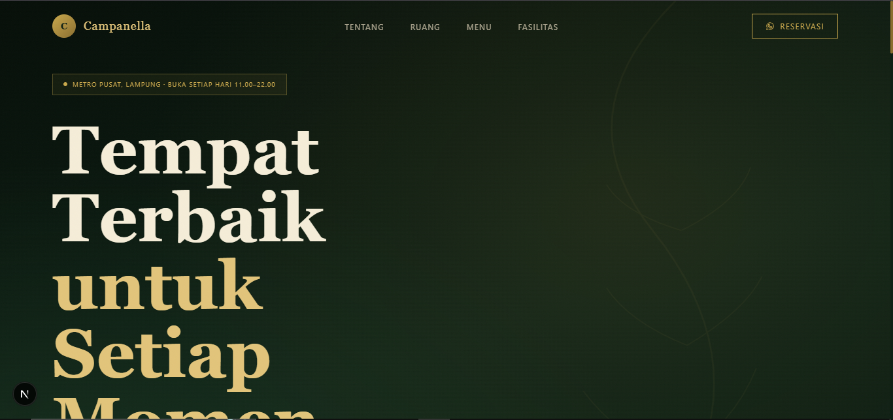
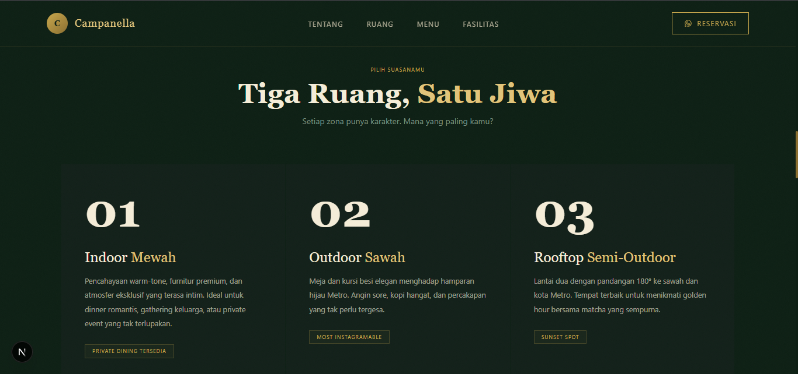
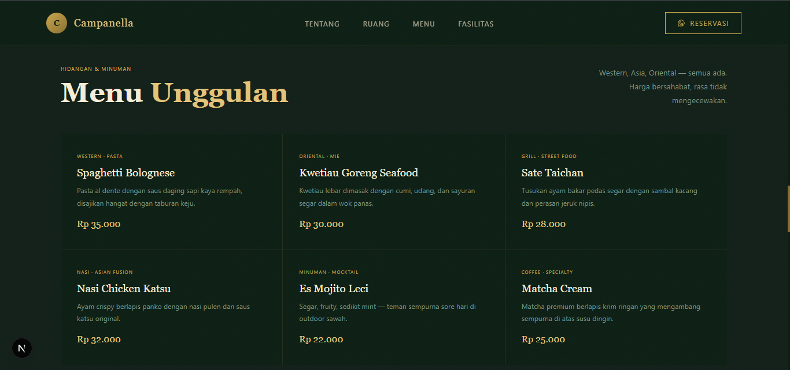

<div align="center">

<br />

<!-- Logo placeholder — ganti dengan logo Campanella asli -->


<br />
<br />

# Campanella Coffee & Eatery

**Website resmi Campanella Coffee & Eatery, Metro, Lampung.**  
Dibangun sebagai demo profesional dengan pendekatan *luxury dark-green* yang mencerminkan brand identity asli kafe.

<br />

[](https://nextjs.org)
[](https://tailwindcss.com)
[](https://www.typescriptlang.org)
[](https://vercel.com)
[](https://phosphoricons.com)
[](https://www.framer.com/motion/)
<br />

[**→ Lihat Demo Live**](https://campanella.vercel.app) &nbsp;·&nbsp; [Laporkan Bug](../../issues) &nbsp;·&nbsp; [Request Fitur](../../issues)

<br />

</div>

---

## Tampilan

| Hero | Spaces | Menu |
|------|--------|------|
|  |  |  |

---

# Stack

| Layer | Teknologi |
|---|---|
| Framework | **Next.js 16** — App Router |
| Styling | **Tailwind CSS v3.4** |
| Language | **TypeScript 5** |
| Animation | **Framer Motion** |
| Icons | **Phosphor Icons** |
| Fonts | Playfair Display + DM Sans |
| Deploy | **Vercel** |

---


## Fitur

- **Dark forest green + gold** — brand palette yang diambil langsung dari konten Instagram @campanellacoffeeandeatery
- **Phosphor Icons** — lineweight `thin` untuk estetika premium, konsisten di seluruh halaman
- **Scroll reveal** — animasi IntersectionObserver tanpa library tambahan
- **Marquee ticker** — pure CSS animation, zero JS
- **Mobile-first** — navbar dengan drawer animasi, fully responsive
- **Single source of truth** — semua konten dikelola dari `src/lib/data.ts`
- **SEO-ready** — metadata lengkap via Next.js Metadata API
- **Aksesibel** — semantic HTML, aria-label pada icon-only button

---

## Struktur Project

```
campanella/
├── src/
│   ├── app/
│   │   ├── globals.css          # Base styles, font, animasi, scrollbar
│   │   ├── layout.tsx           # Root layout + metadata SEO
│   │   └── page.tsx             # Entry point — assembles semua section
│   │
│   ├── components/
│   │   ├── Navbar.tsx           # Fixed nav + mobile drawer (List/X icon)
│   │   ├── Hero.tsx             # Full-height hero + badge icons + CTA
│   │   ├── Ticker.tsx           # Marquee brand ticker (pure CSS)
│   │   ├── About.tsx            # Brand story + quote card + stat row
│   │   ├── Spaces.tsx           # Tiga zona ruang dengan gold-line hover
│   │   ├── Menu.tsx             # Grid menu highlight + seasonal promo
│   │   ├── Features.tsx         # 8 fasilitas dengan icon ring hover
│   │   ├── Visit.tsx            # CTA block + info cells dengan Phosphor icons
│   │   ├── Footer.tsx           # Footer dengan social icons (IG, WA, Maps)
│   │   ├── SectionLabel.tsx     # Reusable eyebrow label
│   │   └── PhosphorIcon.tsx     # Dynamic icon resolver (tree-shakeable)
│   │
│   └── lib/
│       └── data.ts              # ← SATU-SATUNYA FILE yang perlu diedit
│
├── public/                      # Aset statis (logo, foto)
├── tailwind.config.ts           # Custom tokens: forest, gold, cream, moss
├── next.config.js
├── vercel.json
└── package.json
```

---

## Cara Menjalankan Lokal

**Prasyarat:** Node.js 18+ ([download](https://nodejs.org))

```bash
# Clone repo
git clone https://github.com/username/campanella-web.git
cd campanella-web

# Install dependencies
npm install

# Jalankan dev server
npm run dev
```

Buka [http://localhost:3000](http://localhost:3000) di browser.

---

## Deploy ke Vercel

### Opsi A — Vercel CLI *(paling cepat)*

```bash
npm install -g vercel
vercel login
vercel --prod
```

### Opsi B — GitHub Integration

1. Push ke GitHub
2. Buka [vercel.com/new](https://vercel.com/new)
3. Import repo → **Deploy**

URL live tersedia dalam ~60 detik.

---

## Update Konten

Semua konten website dikontrol dari **satu file**: [`src/lib/data.ts`](src/lib/data.ts)

```ts
// Ganti info bisnis
export const BRAND = {
  name: "Campanella",
  wa: "6285166265757",      // nomor WA tanpa +
  hours: "11.00 – 22.00",
  // ...
};

// Tambah/edit menu
export const MENU_ITEMS = [
  { category: "Coffee", name: "V60 Pour Over", desc: "...", price: "Rp 28.000" },
  // ...
];

// Ganti promo seasonal
export const PROMO = {
  label: "Promo Akhir Tahun",
  desc: "...",
  price: "55K",
};
```

Tidak perlu menyentuh komponen sama sekali.

---

## Design Tokens

Brand palette didefinisikan di `tailwind.config.ts` dan bisa dipakai langsung sebagai Tailwind class:

| Token | Hex | Class Tailwind | Digunakan untuk |
|---|---|---|---|
| `forest` | `#0d1f14` | `bg-forest` | Background utama |
| `forest-2` | `#122019` | `bg-forest-2` | Background section alt |
| `forest-4` | `#1e3d26` | `bg-forest-4` | Card, hover state |
| `gold` | `#c9a84c` | `text-gold`, `border-gold` | Accent utama |
| `gold-light` | `#e2c47a` | `text-gold-light` | Heading italic, highlight |
| `gold-dim` | `#8a6e30` | `bg-gold-dim` | Divider, rule |
| `cream` | `#f5edd8` | `text-cream` | Body text utama |
| `moss` | `#7a9180` | `text-moss` | Subtitle, muted text |

---

## Icon System

Menggunakan [Phosphor Icons](https://phosphoricons.com) dengan strategi import per-komponen agar tree-shaking tetap optimal:

```tsx
// Contoh: icon thin untuk dekoratif (badge, card)
import { Coffee, MapPin } from "@phosphor-icons/react";

<Coffee size={26} weight="thin" className="text-gold" />

// Icon regular untuk fungsional (CTA, nav)
import { WhatsappLogo } from "@phosphor-icons/react";

<WhatsappLogo size={16} weight="regular" />
```

Weight `thin` → luxury feel · Weight `regular` → fungsional & terbaca

---

## Scripts

```bash
npm run dev      # Development server (localhost:3000)
npm run build    # Production build
npm run start    # Jalankan production build lokal
npm run lint     # ESLint check
```

---

## Lisensi

Project ini dibuat sebagai **demo komersial** untuk keperluan presentasi ke klien.  
Konten brand (nama, logo, foto) adalah milik Campanella Coffee & Eatery.

---

<div align="center">

Dibuat dengan ☕ untuk Campanella Coffee & Eatery · Metro, Lampung

</div>
